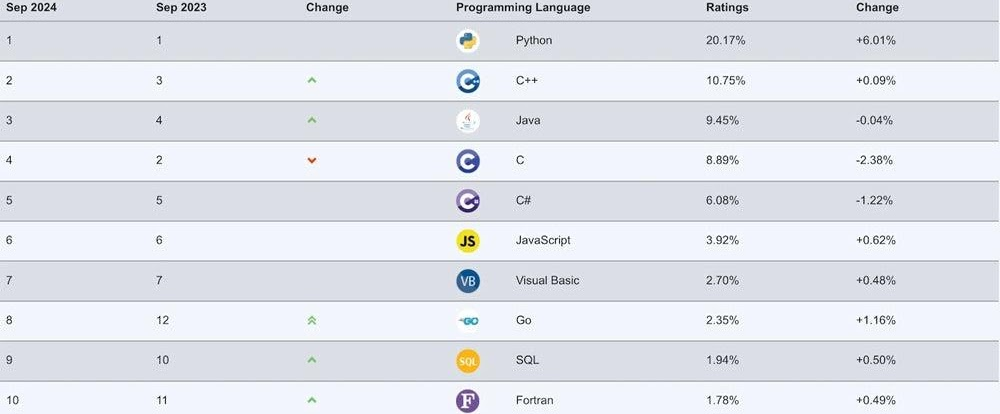
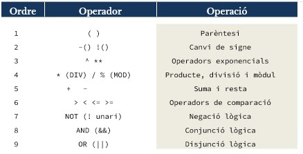
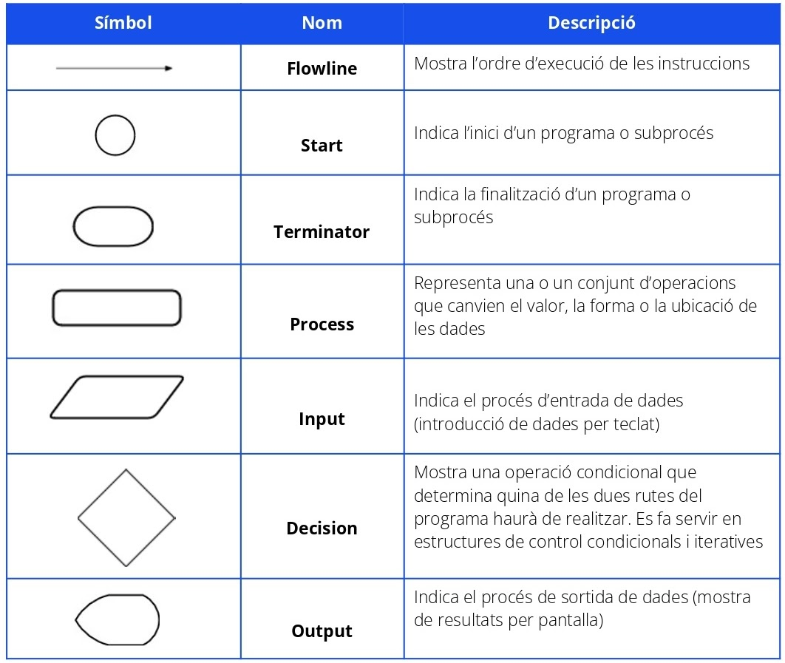
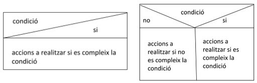
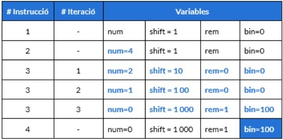

# T1. Introducción

1. **Introducción a la programación**

    1. **Origenes de la programación**
    La informatica a evolucionado gracias a muchos cientificos importantes. Algunas de las contribuciones mas importantes podrian ser.
    _**Joseph Marie:**_ Automatizador de la maquina Teler de Jacquard
    _**Alan Turing:**_ Creaor de la maquina Turing, considerado el padre de la informatica moderna.

    1. **Lenguaje de la programación**
    Un lenguaje de programación te permite la comunicacion entre el hombre y la maquina.
    Los lenguajes de programacion se clasifican en:
        * ***Nivel de abstraccion:*** 
        Esto indica si las instrucciones estan mas o menos vinculadas al funcionamiento del ordenador.
        Un **lenguaje de alto nivel** se caracteriza por expresar su sintexis mas parecida al lenguaje humano
        En un **lenguaje de bajo nivel** por otro lado sus instrucciones ejercen control directo sobre la maquinaria. Se suelen sar para tareas mas criticas del sistema operativo.

        * ***Tipo de traduccion:***
        Segin el tipo de traducion a lenguaje maquina podemos separarlos en 2
            - **Lenguaje compilado:** Traducen todo el codigo fuente y la guardan en un archivo ejecutable que la maquina pueda entender. Este archivo puede ser ejecutado cuantas veces sean necesarias sin repetir el proceso de copilacion. Pero solo se podra ejectar en el sistema operativo en el que se ejecuto.
            - **Lenguaje interpretados:** Traducen el codigo fuente paso a paso. La traduccion del programa se repite cada vez que se ejecuta el programa
        * _**Como ejecuta un programa el ordenador:**_
            -   S’introdueixen les dades a l’ordinador
            -   El processador executa les instruccions
            -   Els resultats de les operacions s’emmagatzemen a la RAM
            -   Els resultats finals s’emmagatzemen al disc dur
    1. **Clasificación del lenguaje**
    Los lenguajes de programacion se han clasicado en distintas generacions.
        -   _**Primera generacion :**_ Es el lenguaje de la maquina, se escribe con 0 y 1 
            -   _Ventajas :_ rapido ya que se escribe en 0-1, no necesita un traducotr.
            -   _Desventajas :_ Dificultad al escribir todo en binario, y muy dificil de entender
        -   _**Segunda generacion :**_ Llamados lenguajes Ensablador. Tiene algunos sentencas leibles por un humano.
            -   _Ventajas :_ Mas facil de entender comparado con el lenguaje maquina. Las modificaciones son mas faciles.
            -   _Desventajas :_ Requiere un Assemblador. Este lenguaje depende de cada maquina, por lo que cambiara dependiendo de la maquina.
        -   _**Tercera generacion :**_ Conocidos como lenguajes de alto nivel. Sustituye instrucciones simbolicas por codigo parecido al lenguaje humano.
            -   _Ventajas :_ El uso de palabras parecidas al ingles lo convierte en un idioma mas comprensible para el humano. Requiere menos lineas de codigo. El mismo codigo puede copiarse en otras maquinas utilizando un compilador.
            -   _Desventajas :_ Requiere un compilador. Requiere distintos compiladores segun la maquina
        -   _**Cuarta generacion :**_ Lenguajes de proposito especifico. Aportan un nivel muy alto de abstraccion. Permite desarrollar aplicaciones sofisticadas en un en un espacio de tiempo mucho inferior a los idiomas de 3ra generacion.
            -   _Ventajas :_ Facil de aprender, requiere menos tiempo para crear una aplicaicon. Es menos propenso a errores.
            -   _Desventajas :_ El consumo de memoria es mas elevado. Menos flexibles que los idiomas de 3era generacion
        -   _**Quinta generacion :**_ En esta generacion entramos ya en la inteligencia artifical. 
            -   _Ventajas :_ Las maquinas pueden tomar desiciones. El esfuerzo del programador para resolver un problema se reduce. Mucho mas facil de aprender y usar que los demas lenguajes.
            -   _Desventajas :_ Codigo complejo y largo. Se necesitan mas recursos y son mas caos
    1. **Paradigmas de programacion**
    Consisten en los metodos para llevar a cabo calculos y en la forma en la que los estructuramos y organizamos las tareas que realiza un programa.
        -   _**Programacion Imperativa :**_ Es el mas usado generalmente, se basa en dar instrucciones al ordenador de como hacer las cosas en forma de algoritmo. Idiomas que lo usan C, BASIC o Pascal
        -   _**Programacion Orientada a objetos :**_ Esta basada en un paradigma imperativo, pero embarca elemenots denominados objetos. Se considera JAVA como el lenguaje por excelencia.
        -   _**Programacion por sucesos :**_ Este es un paradigma en el que tanto la estructura como la ejecucion de los programas van determinados por sucesos que provienen del sistema. Uno de los lenguajes que lo usa seria Visual Basic.
        -   _**Programacion declarativa :**_ Se basa en describir el problema declarando propiedad y reglas que se tienen que cumplir, en lugar de instrucciones. La solucion es obtenida mediante mecanismos internos sin especificar como encontrarla. 
        -   _**Programacion multiparadigma :**_ Es el uso de dos o mas paradigmas dentro de un mismo programa. El objetivo de esto es permitir al programados utilizar el mejor paradigma segun en lo que quiera trabajar. Algunos lenguajes multiparadigmas podrian ser PYTHON -PHP o Lisp.
    1. **Lenguaje de programación mas popular**
        No hay un mejor idioma de programacion, pero si hay idiomas que se adaptan mejor segun lo que quieres.
        

1. **Diseño de algoritmo** 
Para diseñar un algoritmo pasaremos por distintos apatados que seran.
Analisis-diseño-programacion-compilacion-ejecucion y pruebas.

    1. **Analisis**
    En esta fase se estudia el problema a resolver. Que solucion pide, que datos nos dan, como podriamos solucionarlo etc...

        1. **Los datos** 
        Es una representacion simbolica de una caracteristica que por si sola no tiene importancia, pero utilizada de manera correcta nos permite realizar calculos o tomar decisiones. Hay distintos tipos de datos
            - Simples:  
                -   Numericas: Pueden ser enteros osea sin decimales o reales con decimales
                -   No numerica: boleanas osea verdadera o falso
                o caracter que esta representado por una unidad de texto.
            - Estructuradas: 
                -   Internas: estaticas (registros, verctores, tablas) o dinamicas (Llistas, colas, pilas, arboles)
                -   Externas: ficheros, base de adots

        1. **Las expresiones**
        Una expresion es la representacion de diversos operadores
        

    1. **Diseño**
    Durante la fase de diseño se decriben de manera precisa las tareas a realizar por el programa

        1. **Especificacion:** Aqui tendremos que describir los pasos que tendra que seguir el algoritmo para dar una solucion.
        1. **Pseudocodico:** Es una descripcion a muy alto nivel sobre la estructura del programa, se encapsula dentro de dos sentencias que marcan el inicio y el final.
            ```Pseudocodigo
            program <nom>:
            <cos del programa principal>
            endprogram 

        1. **Diagrama de flujo** Es una representacion grafica simple de la estructura de un programa. Los distintos tipos de operaciones se representan a partir de un determinado conjunto de simbolos
        
        1. **Diagrama de Nai noseque**
        Son representaciones graficas del diseño, estan basados en la representacion de las diferentes instrucciones en forma de cajas.
        
        1. **Juego de pruebas**
        Cuando diseñamos un algoritmo hace falta realizar las pruebas necesarias para evaluar que sea valido
        
